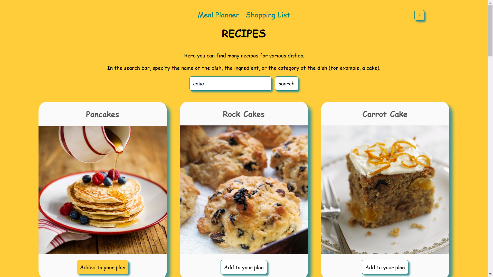

## ❗️ Пожалуйста, обратите внимание, что сайт может работать только с VPN. / Please note that the site can only work with VPN.

# Recipe Finder & Meal Planner 

Поиск рецептов и планировщик питания - это интерактивное веб-приложение для поиска рецептов, планирования питания на неделю и составления списка покупок.
Recipe Search and Meal Planner is an interactive web application for finding recipes, planning meals for the week, and making a shopping list.

## Описание проекта / Description of the project

Приложение позволяет находить интересные рецепты по названию, ингредиенту или категории блюда. В рецептах блюд вы найдете список ингредиентов. Недостающие ингредиенты отмечайте и добавляйте их в список покупок. Формируйте и редактируйте список покупок на основе выбранных ингредиентов. Отмечайте приобретённые продукты и очищайте список покупок. В списке покупок вы увидите все ингредиенты, которые необходимо будет приобрести для приготовления ваших блюд. Добавляйте понравившиеся блюда к себе в список и планируйте питание на неделю, для этого укажите рецепт в плане питания по дням недели и приёмам пищи (завтрак, обед, ужин). 

The application allows you to find interesting recipes by name, ingredient or category of the dish. In the recipes of the dishes you will find a list of ingredients. Mark the missing ingredients and add them to your shopping list. Create and edit a shopping list based on selected ingredients. Mark the purchased products and clear the shopping list. In the shopping list you will see all the ingredients that you will need to purchase to prepare your meals. Add your favorite dishes to your list and plan meals for the week. To do this, specify the recipe in the nutrition plan by day of the week and meals (breakfast, lunch, dinner).



## Что было сделано / What was done

Я разработала это приложение начиная с проектирования структуры и заканчивая интеграцией с Redux для управления состоянием. Одной из ключевых задач было создание удобного интерфейса для планирования меню на неделю и работы с ингредиентами.

Основные функции, которые я реализовала:
* Поиск рецептов по названию, категории или ингредиенту.
* Отображение рецепта блюда со списком игредиентов.
* Сохранение состояния
* Добавление блюд в план питания с возможностью распределить их по дням недели и времени приема пищи.
* Редактирование планов — можно изменять или удалять блюда из расписания.
* Список покупок — отмечайте отсутствующие ингредиенты и собирайте их в общий список.
* Сохранение данных с помощью Redux Persist, чтобы план питания и список покупок не терялись при обновлении страниц.

I have developed this application starting from the design of the structure and ending with integration with Redux for state management. One of the key tasks was to create a user-friendly interface for planning menus for the week and working with ingredients.

The main functions that I have implemented:
* Search for recipes by name, category, or ingredient.
* Displays the recipe of a dish with a list of ingredients.
* Saving the state
* Adding meals to the meal plan with the ability to distribute them by day of the week and meal time.
* Editing plans — you can change or delete dishes from the schedule.
* Shopping List — mark the missing ingredients and add them to the general list.
* Save data using Redux Persist so that the meal plan and shopping list are not lost when updating pages.

## С какими задачами я столкнулась и как их решила / Challenges and Solutions

* Управление состоянием: Мне нужно было обрабатывать сложные состояния, такие как динамическое добавление и удаление блюд, редактирование ингредиентов и синхронизация данных между планировщиком и списком покупок. Я решила эту задачу с помощью Redux Toolkit, создав слайсы для работы с рецептами, планами и покупками.
* Модальное окно: Чтобы сделать взаимодействие с интерфейсом удобным, я использовала React Modal и добавила адаптивность для мобильных устройств.
* Адаптивный дизайн: Для корректного отображения на разных экранах я добавила медиазапросы и использовала flexbox и grid.
* Обработка данных: В работе с ингредиентами возникла необходимость обновлять состояния массивов объектов (например, изменение флага для чекбоксов для добавления ингредиентов в список покупок, в самом списке покупок, а также в планировщике питания на неделю). Это потребовало глубокого погружения в методы работы с объектами и массивами в JavaScript.

* Status Management: I needed to handle complex states such as dynamically adding and removing dishes, editing ingredients, and synchronizing data between the scheduler and the shopping list. I solved this problem using the Redux Toolkit, creating slices for working with recipes, plans, and purchases.
* Modal window: To make interaction with the interface convenient, I used React Modal and added adaptability for mobile devices.
* Responsive design: To display correctly on different screens, I added media queries and used flexbox and grid.
* Data processing: When working with ingredients, it became necessary to update the states of arrays of objects (for example, changing the flag for checkboxes to add ingredients to the shopping list, in the shopping list itself, as well as in the weekly meal planner). This required a deep dive into the methods of working with objects and arrays in JavaScript.


## Технологии / Technologies

* React 19
* Redux Toolkit 2.5
* React Router DOM 7
* Redux Persist 6
* React Modal 3.16


## Установка зависимостей и запуск проекта / Installing dependencies and launching the project

Склонируйте репозиторий / Clone the repository:
```bash
    git clone https://github.com/Maxi-hub/recipe_finder_and_meal_planner.git
    cd recipe_finder_and_meal_planner
    npm install
    npm start
```

Проект будет доступен по адресу / The project will be available at:
http://localhost:3000


### Благодарности / Acknowledgments
Этот проект — результат моего стремления развивать навыки фронтенд-разработки. Я столкнулась с множеством интересных задач, которые позволили мне глубже понять работу с состоянием, маршрутизацией и адаптивной версткой. Буду рада любой обратной связи и предложениям по улучшению функционала!

This project is the result of my desire to develop my frontend development skills. I came across a lot of interesting tasks that allowed me to gain a deeper understanding of working with state, routing, and adaptive layout. I will be glad to receive any feedback and suggestions for improving the functionality!